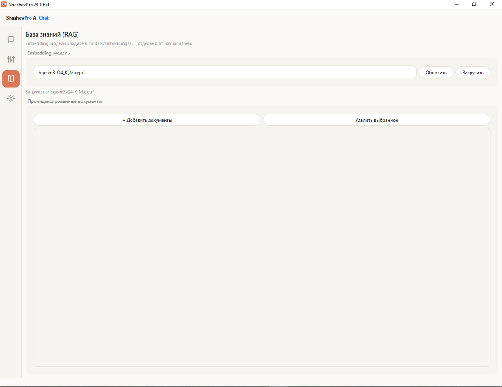
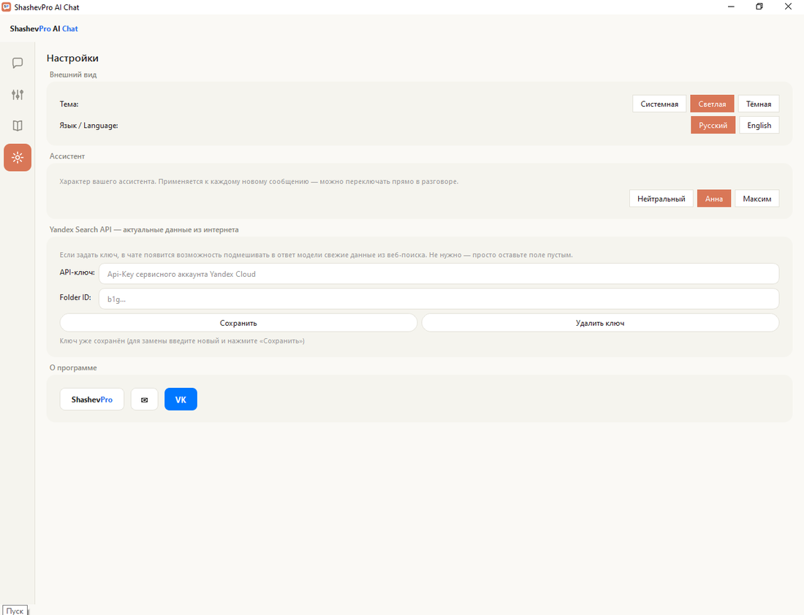

# ShashevPro AI Chat

### Локальный ИИ-ассистент для бизнеса — ваши данные не покидают ваш контур

Приватный чат с ИИ на собственных GGUF-моделях. Работает офлайн, на вашем
железе (CPU или GPU). С базой знаний по вашим документам (RAG) и доступом к
актуальным данным из интернета.

**[shashevpro.ru](https://shashevpro.ru)** · Разработка ShashevPro · 2026

---

> **О репозитории.** Это витрина коммерческого продукта. Здесь опубликовано
> описание возможностей и интерфейса; сама программа поставляется и
> настраивается индивидуально под задачи заказчика. По вопросам внедрения —
> [контакты](#контакты).

---

## Зачем это бизнесу

Облачные ИИ-сервисы (ChatGPT, облачные API) требуют отправлять ваши документы,
переписку и коммерческие данные на чужие серверы. Для многих компаний это
недопустимо: коммерческая тайна, персональные данные, требования безопасности.

**ShashevPro AI Chat решает это радикально: модель работает локально, на вашем
компьютере или сервере. Ни один документ, ни один запрос не уходит наружу**
(кроме опционального веб-поиска, который включается по желанию и только для
справочных запросов).

Это ИИ-ассистент корпоративного уровня, полностью под вашим контролем.

---

## Ключевые возможности

- **Полностью локальная работа.** Модель (в формате GGUF) запускается на вашем
  железе через движок llama.cpp. Интернет не требуется. Данные остаются у вас.
- **Два варианта под любое железо:**
  - **CPU-версия** — работает на обычном офисном компьютере без видеокарты.
  - **GPU-версия** — ускорение на видеокарте (NVIDIA), параметр «Слоёв на GPU»
    для тонкой настройки скорости под вашу карту.
- **База знаний (RAG).** Загрузите свои документы — договоры, регламенты,
  инструкции, базу — и ассистент отвечает со ссылкой на них. Отдельная
  embedding-модель, семантический поиск по смыслу, а не по ключевым словам.
- **Актуальные данные из интернета.** Опциональное подключение Yandex Search
  API — ассистент подмешивает в ответ свежую информацию (курсы, ставки, новости),
  когда это нужно. Отключается одним полем.
- **Гибкая настройка модели.** Размер контекста, температура, top-p, лимит
  ответа, системный промпт, поддержка vision-моделей (mmproj) — всё под
  капотом, с сохранением профиля под каждую модель.
- **Персоны ассистента.** Готовые характеры ассистента, переключаются прямо
  в разговоре.
- **Приватность по умолчанию.** Тёмная и светлая темы, русский и английский
  интерфейс, вся история — только на вашем диске.

---

## Интерфейс

### Чат
Чистый диалоговый интерфейс. Переключатели «Искать в базе знаний (RAG)» и
«Актуальные данные (Яндекс)» прямо над полём ввода — включаете нужное для
конкретного вопроса. Поддержка вложений перетаскиванием.

### Локальные модели
Загрузка и настройка GGUF-моделей. Программа показывает архитектуру модели,
заявленный контекст, квантование и размер файла. Все параметры инференса — в
одном месте, с индикатором доступности GPU-ускорения.

### База знаний (RAG)
Индексация ваших документов отдельной embedding-моделью. Добавляйте и удаляйте
документы, ассистент ищет ответы по ним.

### Настройки
Тема, язык, персона ассистента, подключение веб-поиска. Всё в одном экране,
по-человечески подписано.

---

## Технологии

- **Движок инференса:** llama.cpp (GGUF-модели, CPU и CUDA-сборки)
- **RAG:** локальные embedding-модели, семантический поиск
- **Веб-поиск:** Yandex Search API (опционально)
- **Интерфейс:** настольное приложение для Windows
- **Архитектура:** полностью офлайн, данные не покидают устройство

---

## Варианты поставки

| Вариант | Для кого |
|---|---|
| **CPU** | Офисные ПК без видеокарты. Работает везде, скорость скромнее. |
| **GPU** | Машины с видеокартой NVIDIA. Ускорение инференса в разы. |

Каждый вариант настраивается индивидуально под задачи и железо заказчика:
подбор модели, объём базы знаний, персоны ассистента, интеграции.

---

## B2B — внедрение под заказчика

Продукт поставляется и настраивается индивидуально:

- подбор и настройка модели под ваши задачи и железо;
- наполнение базы знаний вашими документами;
- настройка персон ассистента под ваши сценарии;
- развёртывание на рабочих местах или на сервере компании;
- обучение сотрудников, сопровождение.

**Хотите такой ассистент для своей компании — напишите, настрою под вас.**

---

## Контакты

- **Сайт:** [shashevpro.ru](https://shashevpro.ru)
- **Разработчик:** ShashevPro
- **VK:** [vk.com/shashevpro](https://vk.com/shashevpro)

---

© 2026 ShashevPro. Все права защищены.
Данный репозиторий фиксирует авторство и описание продукта ShashevPro AI Chat.

